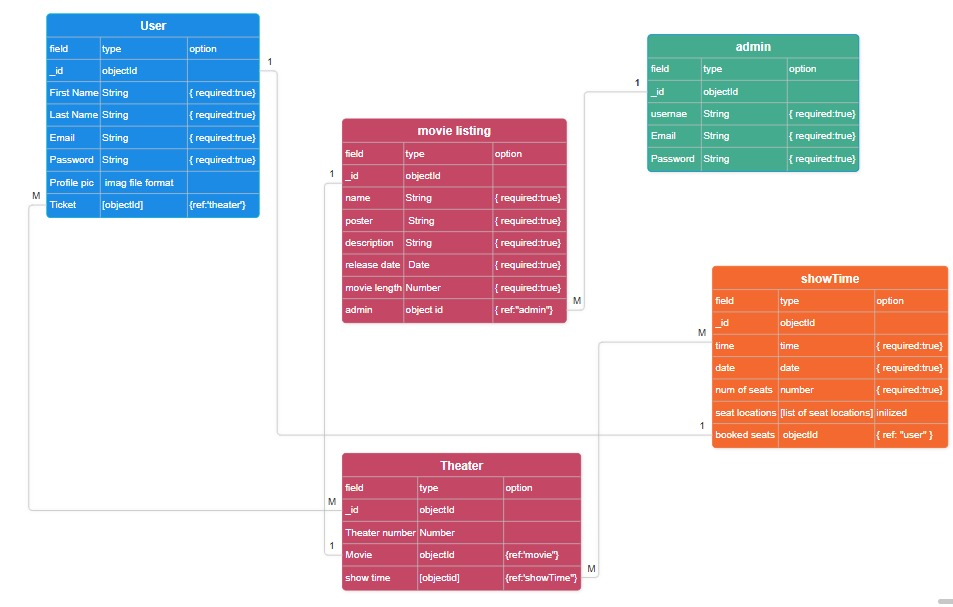

# CineGate

## Date: 20/7/2025

---

### By: Fatema Mohamed, Fares Albuflasa, Maryam Salah

#### [GitHub](https://github.com/FerasAlbuflasa01/cinema-website)

---

### **_Description_**

The platform enables users to explore currently showing movies, check screening times, and seamlessly reserve or book tickets. Additionally, users can view ratings, discover the most popular and recommended films, and make informed viewing choices.For administrators, the system includes a backend dashboard allowing them to manage movie listings, showtimes, theater information, and user bookings. Admins can add, update, or delete content as needed, making it easy to keep the cinema’s schedule up-to-date and relevant.

---

### **_Technologies Used_**

- HTML
- CSS
- JavaScript
- Node.js
- Express
- MongoDB
- Mongoose
- Multer ( for image upload )

---

### **_Getting Started_**

Sign up and sign in as a new user and then begin viewing the different sections of the website.

Once signed in, users can browse available movies, check showtimes, and reserve tickets.

The project is currently under development and will be deployed soon.

You can track the development progress through the GitHub repository [here](https://github.com/FerasAlbuflasa01/cinema-website).

---

### **_Project Preview_**

- All project screenshots and visual references can be viewed [here](https://drive.google.com/file/d/1jH3iORZ3LbZDXxyJwevK8hZ0L3YHkoAa/view)

- To tarck our project at trello [here](https://trello.com/b/cEx1qjnE/cinegate)

- ERD 

---

### **_Future Updates_**

- Integrate a secure online payment system to allow users to complete ticket purchases directly on the platform.

- Expand the platform to include showtimes and movies from multiple cinema providers, offering a unified experience without the need to visit each cinema's website individually.

---

### **_Credits_**

#### UI Design Inspiration: [Epix](https://www.epixcinemas.com/), [VOX Cinemas](https://bhr.voxcinemas.com/showtimes?&w=th&gad_source=1&gad_campaignid=21065925566&gbraid=0AAAAAC6jtJQEj1a4qUvOQdtK6PwN5cgwE&gclid=Cj0KCQjwhO3DBhDkARIsANxrhTo31WIDpK9HbScP1E0o6ZWRUmMzMcUXT8gIJRtYx1vwpZ03APsSVVcaAufAEALw_wcB)

#### Markdown Cheatsheet: [GitHub](https://github.com/FerasAlbuflasa01/cinema-website)

#### Using Multer: [YouTube](https://www.youtube.com/watch?v=wIOpe8S2Mk8)

---
